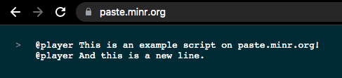
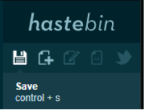
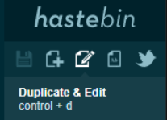

Tutorial
======================

This tutorial is designed to give players who are new to scripting a brief introduction to the MSC 2.0 language. We'll cover the basics on scripting and provide the most important points to remember without overcomplicating and going into too much detail. Once you're done with this tutorial, you should know how to create basic scripts such as dialogues and prompts, and have a general idea of how MSC 2.0 works and what you can do with it.

.. contents:: Tutorial Contents

.. _tutorial_desc:

What is MSC?
----------------

MSC is the scripting language developed for Minr. It is extremely powerful and often simpler than command blocks. Over the years, its use in maps and on the server has grown enormously, allowing for anyone to learn the language.

Every script consists of script lines, which are the actual content of a script. A script is executed from top to bottom, waiting, delaying and executing commands as necessary. 

.. _tutorial_script_types:

Script types
----------------

Before we create our first script, an introduction of the types of scripts you can create are necessary.

There are 6 types of scripts - more detailed information can be found :ref:`here <scripts_script_types>`. A basic rundown of the types is below:

**interact** - placing an interact script on a block causes the script to be triggered upon the player clicking the block (e.g., stone, button, or any other block). The interact script type is often used for chat answer submissions, submit buttons, dialogue, and much more.

**walk** - placing a walk script on a block causes the script to be triggered when the player walks over the block containing the script. If the script was bound to a block that is now removed, the script still triggers when the player is in the space just above the block. The walk script type is often used for traps, story elements, resets, and much more.

**ground** - placing a ground script on a block causes the script to be triggered only when the player walks over the block. The script triggers when the player is on the block, and not while jumping on it, or if the block is air. The ground script type can be used for crumbling pathways and other effects that require the player to stand on the block.

**entity** - placing an entity script on an entity (e.g. armor stand, mob, etc.) causes the script to trigger when a player clicks the entity. The script gets removed once the entity dies or despawns. The entity script is often used for dialogue.

**area** - area scripts can be placed on WorldGuard regions. The script gets triggered once when a player enters the region.

**function** - We will get into this later as it is more complex for those who have not coded before. To create content in a function, the function type is used. A function is always explicitly called from a script or other function. When adding script lines to a function, the function has to be defined using the function command.

.. _tutorial_script_operators:

Script operators
-------------------

Every line within a script contains exactly one operator. The operator gives meaning to the line, because it determines what has to be done with the arguments. There are operators to execute commands, control the script flow and manipulate variables. An overview is located :ref:`here <script_operators>` and a full summary is located here: :ref:`here <appendix_scripts_script_operators>`

There are a good amount of operators, so we'll introduce you to the most used ones first.

**@command <command>**

Execute a command as the player. Can only execute the commands the player can also execute. For example, the script

.. code-block:: python
    
    @command /tp 0 100 90

will not work for non staff members. However, if a staff member were to run the command, it would work, as staff members have access to /tp.

The following script:

.. code-block:: python

    @command /spawn

will work for all players, as all players are able to do /spawn

**@bypass <command>**

Execute a command as the player in an elevated position. Allows the execution of most admin commands. This is very useful for commands such as /tp or /setblock, which are only available to staff. For example, if we write the same script as before with bypass, it works for all players and tps them to the coordinates 0 100 90:

.. code-block:: python
    
    @bypass /tp 0 100 90

**@player <message>**

Displays the given message to the player in the chat. For example, if I were to create the following script:

.. code-block:: console

    @player Hello!

and then click it, I would be displayed

.. code-block:: console

    Hello!

in my Minecraft chat.

.. _tutorial_script_actions:

Script actions
--------------------

Here, we'll show how you can create, delete, and modify a script on the server. More details are located :ref:`here <scripts_action>`.

**/script create <@operator> <script>**

Adds a line to the end of the script. For example, if I were to run this on the server and place it on a block by clicking the block:

.. code-block:: console

    /script create interact @player hi!

The block would have the following interact script attached to it:

.. code-block:: console

    @player hi!

You can also add a script line with /script create <line> <@operator> <script> to add the script on the given line number instead.

**/script view <type>**

View the lines of the script in chat. For example, if I were to view the script I placed on the block in the previous paragraph, I run this command and then click the block I placed it on:

.. code-block:: console

    /script view interact

And in my chat, I would see

.. code-block:: console

    @player hi!

**/script remove <type>**

Removes the script with the given type. For example, if I were to remove the script that we created earlier, I would run this command and click the block I placed it on:

.. code-block:: console

    /script remove interact

and the block would no longer have an interact script attached to it.

.. _tutorial_hastebin:

Paste.minr.org
--------------

Minecraft has a pretty terrible way of inputting scripts. There’s the option through chat,
but that gets unreadable fast, and does not support multiple lines. We could use books,
but they have limited horizontal space, which means most lines would wrap. Signs are
no option either. There must be a better way to type scripts, right?

MSC 2 supports `paste.minr.org <https://paste.minr.org/>`_, which is an online coding pastebin based on Hastebin. You can write text, press
save, and a link will be generated that you can share with everyone. MSC 2.0 takes this
raw text line by line, and converts it to a script.

Script can be imported from paste.minr.org using:

.. code-block:: console

    /script import ... <id>

and exported using

.. code-block:: console

    /script export ...

When you save your piece of text on paste.minr.org, your URL will be appended by an identifier
(a few random characters). You should use this identifier as the id when importing.

Exporting will upload the current script to paste.minr.org, after which you can clone and edit
the script, and import the edited script.

Paste.minr.org uses automatically detected programming languages, resulting in MSC lines
being picked up as some programming language. Paste.minr.org will automatically include
the programming language’s extension. Whether you include the extension, or even the
entire URL, or not, it will work regardless.

Example

Figure 5.1: Write a script in paste.minr.org

Figure 5.2: Save the script.

    
Figure 5.3: Find the identifier.

.. code-block:: console

    /script import interact fomomokumo

Figure 5.4: Run the import command, and press the block. That’s it!

Exporting a script is as easy as running

.. code-block:: console

    /script export interact

and clicking the block, after which a link to the paste.minr.org will be generated. To edit this
script, you can press the edit button:

Figure 5.5: Click the edit button, and start editing. Then follow the instructions above
to import the script again.

.. _tutorial_first_script:

Creating a dialogue script
----------------------------

And now finally, we're ready to start creating our first script! We will create a dialogue script here. Dialogues are used when you want the player to be shown some text in chat, for example a dialogue with an NPC.

For example, if we want our armor stand to say the message "John: Hi!" in chat, we will run this command and click the armor stand to add the script onto it:

.. code-block:: console

    /script create entity @player John: Hello!

And whenever you click, the armor stand, you should see the following in chat:

.. code-block:: console

    John: Hello!

Chat messages are colored and styled by putting their color code in front of them. You can see https://www.digminecraft.com/lists/color_list_pc.php for a simple list of color codes. For example, if I want the previous script to be in red, I'd create it like this:

.. code-block:: console

    /script create entity @player &cJohn: Hello!

.. _tutorial_advanced_dialogue:

More advanced dialogue
-------------------------

Two control operators that are frequently used with chat scripts are @cooldown and @delay.

**@delay <time>** 

Delays the rest of the executed script by the specified time. This is useful so that if you have an NPC saying a lot of lines, you don't get all the lines spammed to you all at once.

**@cooldown <time>** 

The specified time needs to pass between script executions. This is useful for long dialogues. For example, if you have a dialogue that takes 30 seconds to complete, you don't want the player to be able to run the dialogue again while they're still in the middle of their previous dialogue! Thus, you'd set the cooldown to be 30 seconds or longer.

If we have the following script and we trigger it, the player must wait 10 seconds before they can trigger the script again. "John: Hello!" displays in chat, and then after 5 seconds pass, we see "John: Bye!". 

.. code-block:: console

    @cooldown 10s
    /script create entity @player &4&lJohn: &dHello!
    @delay 5s
    /script create entity @player &4&lJohn: &dBye!

.. _tutorial_variables:

Variables
-----------

A variable is a way of storing information. The Type of the variable determines in what format the value is stored and what operations can be performed on the value. 

Whenever a variable is defined, the Type is always the word immediately preceding the variable's name. For example, the variable *name* defined as:

.. code-block:: python

    @define String name

has the type *String*

You can perform operations of variables with @var. For example:

.. code-block:: python

    @define String name = "Ricky"
    @var name  = name + "boy"
    @player {{name}}

will display

.. code-block::

    Rickyboy

MSC 2.0 comes with a set of predefined types which can be used at any time from any namespace. You can view the list :ref:`here <appendix_built_in_types>`

.. _tutorial_qualifiers:

Qualifiers
-------------

When defining a new type or namespace, sometimes it is useful to have variables that are player relative, or a variable that has a constant value. There are two qualifiers:

**relative** 

A variable that is player-bound. This is MSC 2’s way of defining per-player variables, rather than shared variables. For example, if you have a map where a player needs to collect a certain number of items and you store the number of items they collected in a variable, you want that to be stored *per player* - you don't want every player to have the same item count!

**final**

A constant variable. Once initialized cannot be changed

.. _local_variables:

Writing a script that uses local variables
----------------------------------------------

You can define a local variable like so:

.. code-block:: python

    @define <Type> <name> [= expression]

For example, the following would print Hello World! to the player when they trigger the script.

.. code-block:: python

    @define String message = "Hello World!"
    @player {{message}}

Above, *String* is the type of the variable, *message* is the variable name and "Hello World!" is the string stored in the *message* variable.

.. _tutorial_braces:

Double curly braces
-----------------------------

You can use double curly braces {{ }} to display a variable's contents inside it. As shown above, you can do:

.. code-block:: python

    @define String message = "Hello World!"
    @player {{message}}

to display the following to the player:

.. code-block:: console

    Hello World!

You can do math in them as well (among other things)!

.. code-block:: python

    @player {{5 + 5}}

will display the following to the player:

.. code-block:: 

    10

.. _tutorial_namespaces:

Namespaces
-------------

A namespace consists of variables, functions, and types. A user can define a namespace using a unique name. You can add a namespace to your script by adding @using <namespace_name> to line 1 of your script.

If a namespace is undefined (you do not include a @using operator in the script), the local namespace will be used - the local namespace contains variables that are not persistent. The local namespace is deleted when the script terminates. Thus, in order to have variables that you can keep throughout different scripts, you need to define them in a namespace.

Namespaces can be created with **/namespace define <name>**. For example, to create a namespace called learnmsc:

.. code-block:: 

    /namespace define learnmsc

You can add variables to a namespace with **/variable define <namespace> [qualifier] <Type> <name> [= expression]**. 

You can set a variable's value once it has already been defined with **/variable set <namespace> <name> = <expression>**.

A more concrete example is below:

I create a namespace learnmsc:

.. code-block:: 

    /namespace define learnmsc

I define two variables: message (type String) and number (type Int):

.. code-block:: 

    /variable define learnmsc String message = "Hello"
    /variable define learnmsc Int number = 1

I use it in a script:

.. code-block:: python

    @using learnmsc
    @player {{message}}
    @var number = number + number
    @player {{number}}

.. code-block::

    Hello
    2

.. _tutorial_branching_operators:

Branching Operators
---------------------------

Sometimes a script needs to conditionally execute a part of the script. For this reason
we have branching operators, which provide ways to cause different execution flows
using variables. The branching operators can be nested, causing more and more possible
execution paths. Be warned, as increasing the amount of execution paths greatly
complexifies the script.

**@if <Boolean expression>**

Takes an expression that evaluates to a Boolean. If the Boolean is true, the following
section is executed, if it is false, the section is skipped until reaching an @elseif, @else
or @fi of the same level.

**@else**

Executes the following section if the preceding @if and @elseif operators of the same
level were false.

**@elseif<Boolean expression>**

Executes the following section if the preceding @if and @elseif operators of the same
level were false, and the expression of this @elseif evaluates to true.

**@fi**

Ends the conditional section. Any @if, @else or @elseif operators of the same level will
no longer apply after this operator.

**@return**
Stops the execution of the current script or function, and optionally returns a value.

Because the branching operators can be nested, the script maintains an ’if level’ to
keep track of which @if has impact on which @else and @elseif operators. This level is
demonstrated visually through the use of indentation in both this document and any
script viewings (such as /scripts view).

.. code-block:: python

    @if true
        @player 1
        @return
    @fi
    @player 2

.. code-block:: console
    
    1

.. _tutorial_example2:

Writing a simple counting script
-------------------------------------

First, I'll create the namespace learnmsc

.. code-block:: 

    /namespace define learnmsc

I define the variable *count* of type relative Int (remember, relative is a per-player variable!). I set the initial value to 0 since the player starts with clicking the block 0 times.

.. code-block:: 

    /variable define relative Int count = 0

I put the following code onto it:

.. code-block:: 

    @using learnmsc
    @var count = count + 1
    @player You clicked this block {{count}} times!

This will send the player the number of times they clicked the block in chat, whenever they click on it.

.. _tutorial_example3:

Writing a simple script to check if the player already clicked a block
--------------------------------------------------------------------------

First, I'll create the namespace learnmsc

.. code-block:: 

    /namespace define learnmsc

I define the variable *clicked* of type relative Boolean (remember, relative is a per-player variable!). I set the initial value to False since the player has not clicked the block yet.

.. code-block:: 

    /variable define learnmsc relative Boolean clicked = false

I add the following code to a block (for example, an egg head):

.. code-block::

    @using learnmsc

    @if clicked
        @player You already found this egg!
    @else
        @player Congrats! You found this egg!
        @var clicked = true
    @fi

This script will tell the player "Congrats! You found this egg!" if they have not clicked it before, and then set clicked to True. Thus, the next time they click the egg, clicked will be True, thus the if branch is evaluated, giving the player "You already found this egg!"

.. _tutorial_chat_operators:

Chat Operators
-------------------

There are two chat operators - @chatscript and @prompt. We will look at @prompt as it is more widely used, but you can see the documentation for chatscript as well: :ref:`Chat Operators <scripts_chat_operators>`.

**@prompt <time> <variable> [message]**

Halts the script until the player types something. If time runs out, the script ends here, sending the message the optional message, or ’Prompt expired’ otherwise. Message supports color codes with &.

If the player types something in time, the text the player typed is stored in the passed variable. Therefore, variable has to be of type String.

.. _tutorial_answer_prompt:

Creating an answer prompt
-----------------------------

Here, we'll ask the player what color a banana is. We give them 30 seconds to answer - if they go over the time limit, they get "You took too long. Try again!" and the script terminates. The answer, obviously, is yellow, and will tell them "Correct!" if they successfully answer. If they type anything else, they will get "Incorrect!"

You typically want to run the command .equalsIgnoreCase() on your input. That way, if the user answers with "Yellow", or "YELLOW" (which are both correct!), etc., it will still match with "yellow", as equalsIgnoreCase compares the characters without regard for capitalization.

.. code-block::

    @define String user_input

    @player What color is a banana?

    @prompt 30s user_input You took too long. Try again!
    @if user_input.equalsIgnoreCase("yellow")
        @player Correct!
    @else
        @player Incorrect.
    @fi

Congrats on getting through the tutorial! More coming soon.
